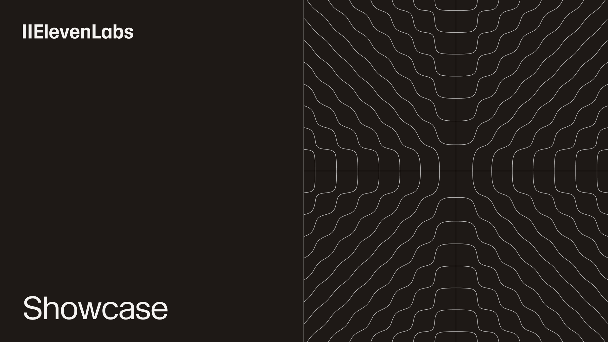

# ElevenLabs Showcase

A curated collection of projects built with ElevenLabs. Builds who submit PR's to this repository & get it approved will receive a reward.

## Submit Your Project

We welcome submissions from developers building with ElevenLabs technology.

### How to Submit

**Follow our step-by-step contribution guide:**

- **[View Submission Instructions](.github/CONTRIBUTING.md)**

The guide covers:

- Creating your author profile
- Adding your project with proper formatting
- Submitting a pull request
- Review process and swag eligibility

### Quick Overview

1. **Fork** this repository
2. **Add** your author profile to `/authors/`
3. **Create** your project file in `/projects/`
4. **Submit** a pull request

### Requirements

- Must use ElevenLabs technology (API, SDK, or services)
- Include working demo, repository, or video
- Have rights to share the project publicly

### Get Help

- [Full Contribution Guide](.github/CONTRIBUTING.md)
- [Browse Existing Projects](https://showcase.elevenlabs.com/projects)
- [Join our Discord](https://discord.gg/elevenlabs)

---
